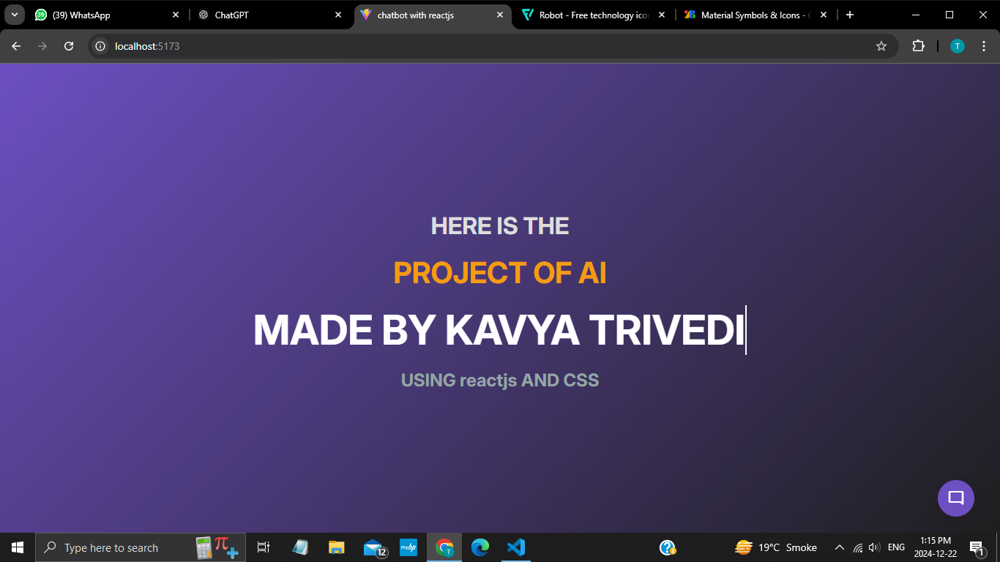
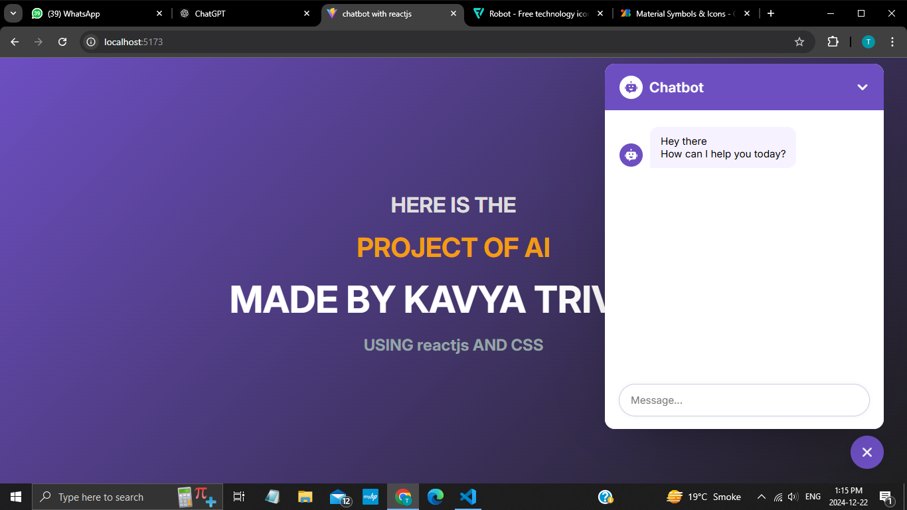
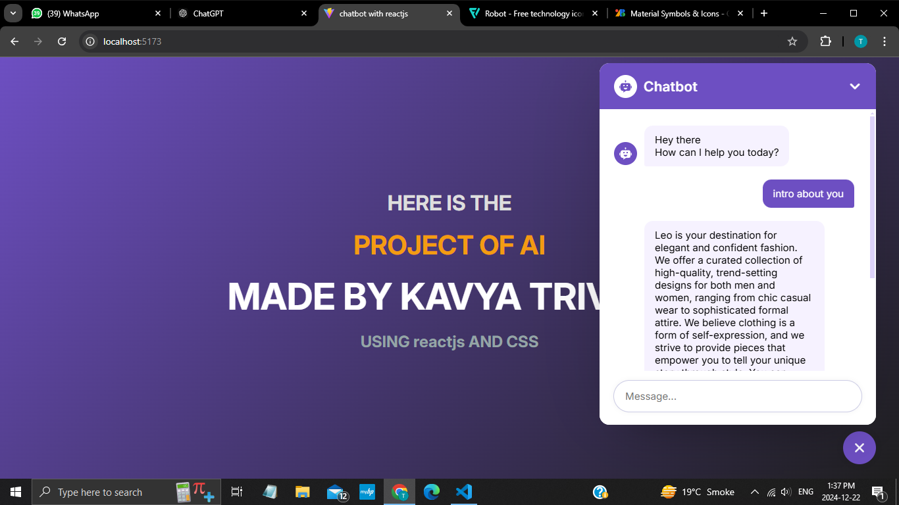

# CHATBOT USING REACT 
## Project Overview: AI-Powered Chatbot for E-Commerce
This project focuses on developing an API-based chatbot using React and useForm to enhance customer interaction on e-commerce and online store websites. The chatbot is designed to provide real-time assistance, answer customer queries, and streamline the shopping experience.

## OUTPUT 
 </img>
 </img>
 </img>

